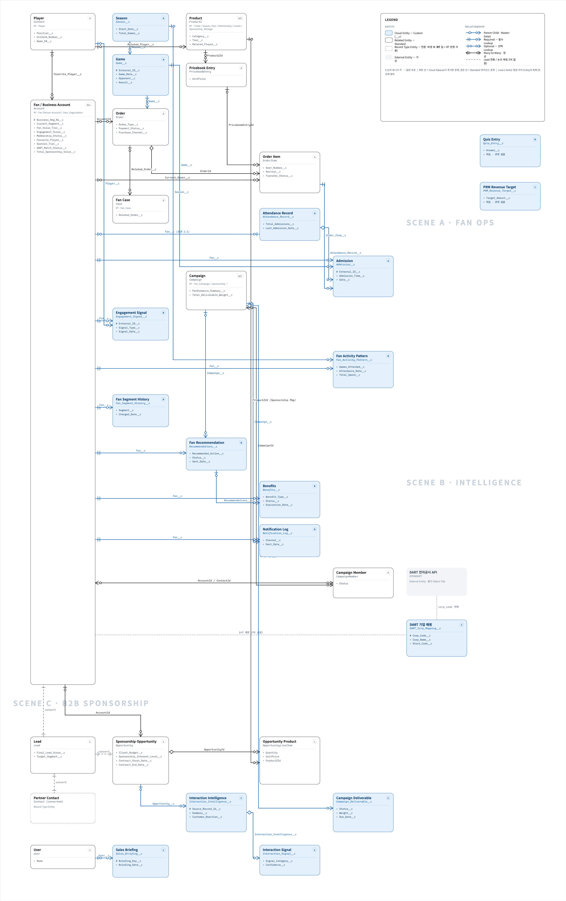
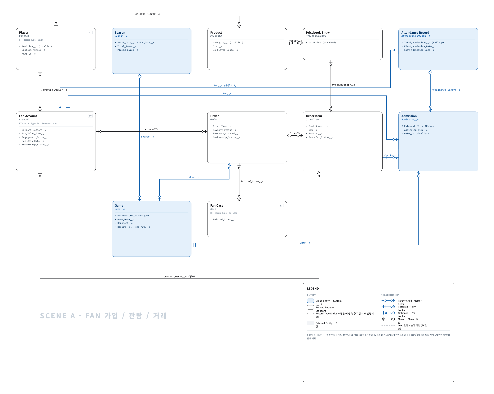
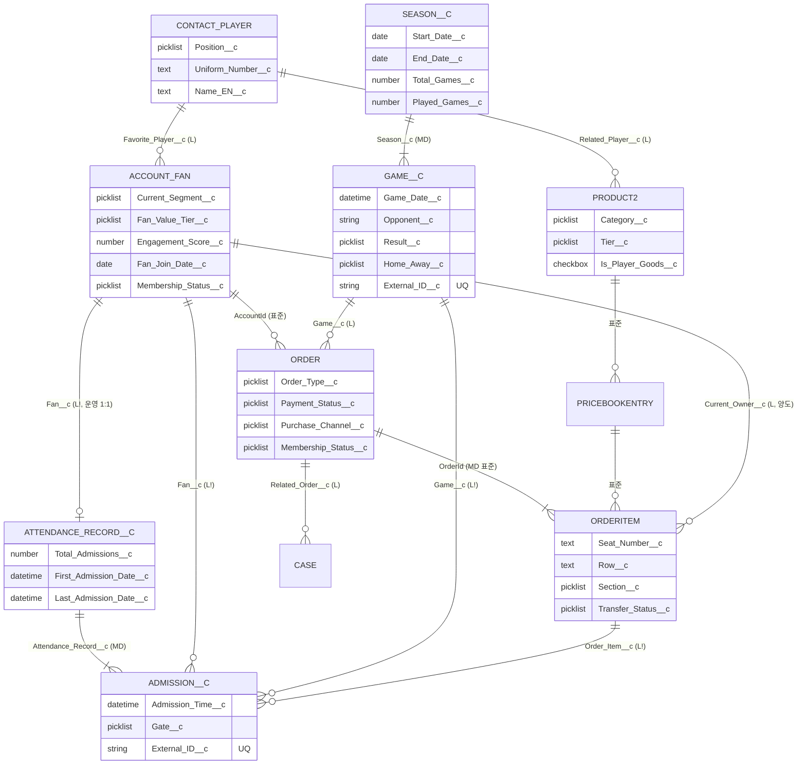
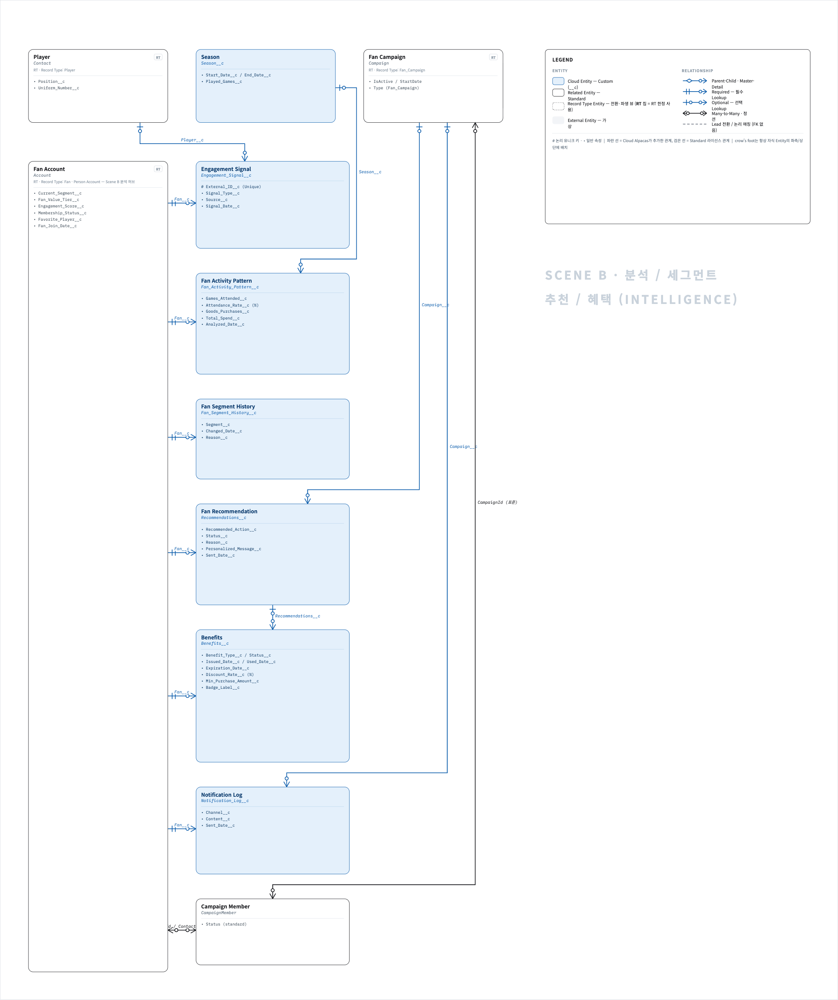
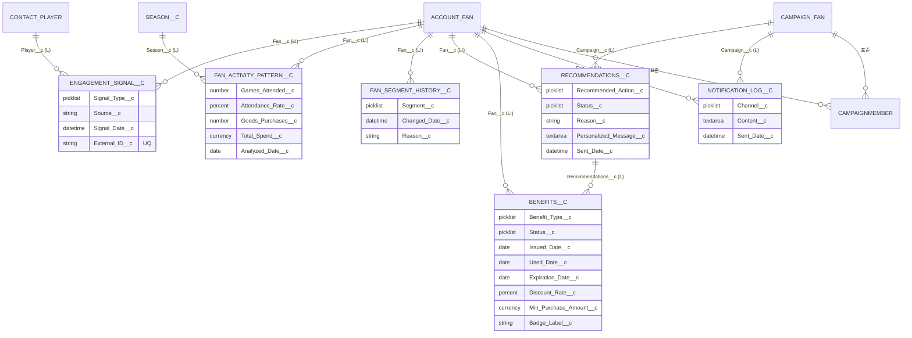
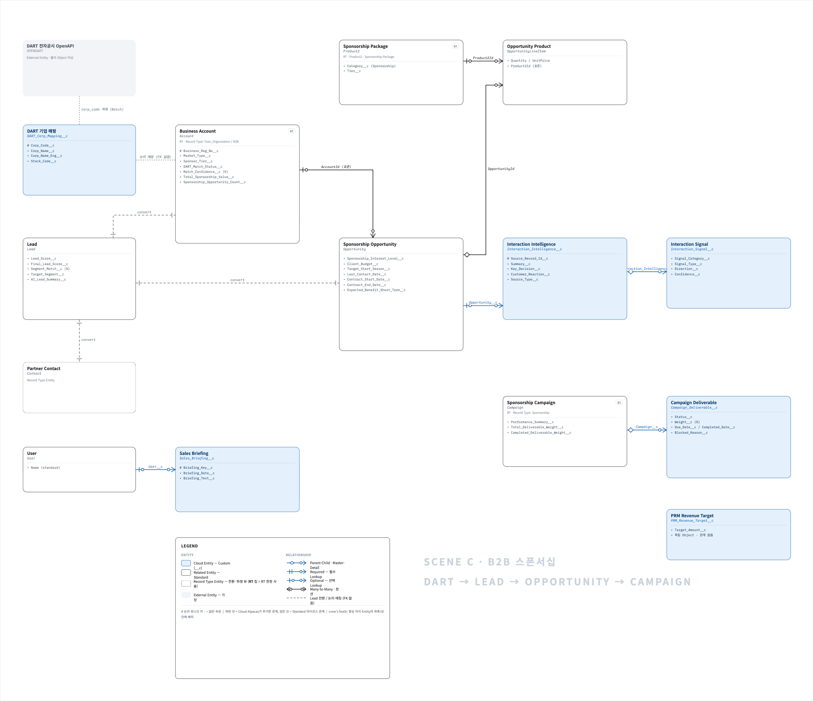
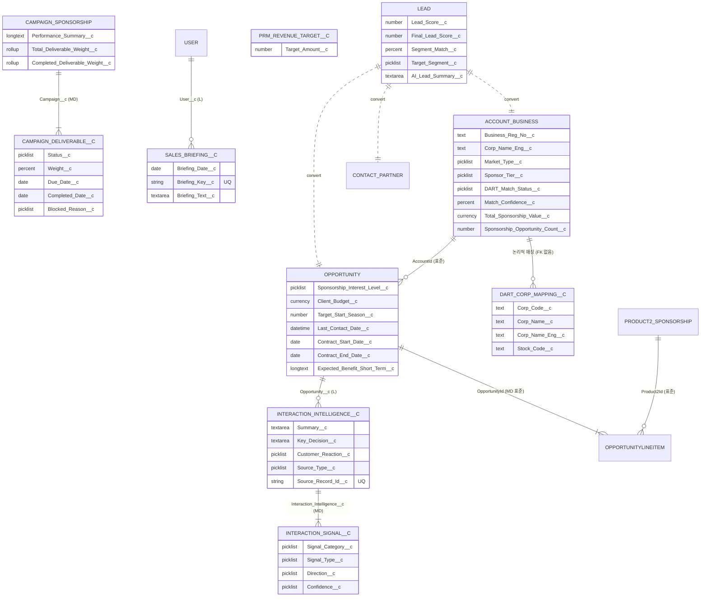

# 01. ERD — Cloud Alpacas Object Data Model

## Scope
- 포함: 팀이 만든 **Custom Object 17개** + 팀이 커스터마이징한 **Standard Object 12개** + 관계

## 표기 규칙
| 기호 | 의미 |
|---|---|
| 🟦 Standard | Salesforce 기본 Object |
| 🟧 Custom | Cloud Alpacas 제작 (`__c`) |
| **MD** | Master-Detail (cascade delete) — 정확히 **4개** |
| **L!** | 필수 Lookup (restrict delete, 삭제 제약) |
| **L** | 선택 Lookup |
| `||--o{` | 1 : N |
| `||--o|` | 1 : 0..1 (운영 규칙상 1:1) |
| `||..||` | 표준 Lead 전환 |

---

## 1. Object 목록

### 1.1 Custom Object (🟧 17)

| Object (Label) | API Name | Scene | Name 필드 | 관계 |
|---|---|---|---|---|
| Season | `Season__c` | Fan 운영 | Text | 부모: Game, Fan Activity Pattern |
| Game | `Game__c` | Fan 운영 | AutoNumber | `Season__c` **MD** |
| Admission | `Admission__c` | Fan 관람 | AutoNumber | `Attendance_Record__c` **MD**, `Fan__c`→Account **L!**, `Game__c` **L!**, `Order_Item__c`→OrderItem **L!** |
| Attendance Record | `Attendance_Record__c` | Fan 관람 | AutoNumber | `Fan__c`→Account **L!** |
| Engagement Signal | `Engagement_Signal__c` | Fan 분석 | AutoNumber | `Fan__c`→Account **L!**, `Player__c`→Contact **L** |
| Fan Activity Pattern | `Fan_Activity_Pattern__c` | Fan 분석 | AutoNumber | `Fan__c`→Account **L!**, `Season__c` **L** |
| Fan Segment History | `Fan_Segment_History__c` | Fan 분석 | AutoNumber | `Fan__c`→Account **L!** |
| Fan Recommendation | `Recommendations__c` | Fan 실행 | AutoNumber | `Fan__c`→Account **L!**, `Campaign__c`→Campaign **L** |
| Benefits | `Benefits__c` | Fan 실행 | AutoNumber | `Fan__c`→Account **L!**, `Recommendations__c` **L** |
| Notification Log | `Notification_Log__c` | Fan 마케팅 | AutoNumber | `Fan__c`→Account **L!**, `Campaign__c`→Campaign **L** |
| Quiz Entry | `Quiz_Entry__c` | Fan Event(P1) | Text | 없음 (독립) |
| Campaign Deliverable | `Campaign_Deliverable__c` | B2B 스폰서십 | AutoNumber | `Campaign__c`→Campaign **MD** |
| Interaction Intelligence | `Interaction_Intelligence__c` | B2B 영업 | AutoNumber | `Opportunity__c`→Opportunity **L** |
| Interaction Signal | `Interaction_Signal__c` | B2B 영업 | AutoNumber | `Interaction_Intelligence__c` **MD** |
| Sales Briefing | `Sales_Briefing__c` | B2B PRM | AutoNumber | `User__c`→User **L** |
| PRM Revenue Target | `PRM_Revenue_Target__c` | B2B PRM | Text | 없음 *(관계 미구현)* |
| DART 기업 매핑 | `DART_Corp_Mapping__c` | B2B Lead | Text | 없음 (Account와 논리적 매핑) — field: `Corp_Code__c`, `Corp_Name__c`, `Corp_Name_Eng__c`, `Stock_Code__c` |

### 1.2 Standard Object (🟦 12, 팀 커스터마이징)

| Object | API Name | Scene | 팀 RecordType |
|---|---|---|---|
| Account | `Account` | 공통 | `Fan`(Person Account), `Own_Organization` |
| Contact | `Contact` | 공통 | `Player` |
| Lead | `Lead` | B2B | — (SDO RT 사용) |
| Opportunity | `Opportunity` | B2B | — (SDO `SimpleOpportunity`/`ChannelPartner` 사용) |
| OpportunityLineItem | `OpportunityLineItem` | B2B | — |
| Campaign | `Campaign` | 공통 | `Fan_Campaign`, `Sponsorship_Collaboration`, `Sponsorship_Prospecting`, `Sponsorship_Renewal` |
| CampaignMember | `CampaignMember` | Fan 마케팅 | — |
| Case | `Case` | Fan 서비스 | `Fan_Case` |
| Order | `Order` | Fan 거래 | — (SDO RT 사용) |
| OrderItem | `OrderItem` | Fan 거래 | — |
| Product2 | `Product2` | 공통 | `Ticket`, `Season_Pass`, `Membership`, `Goods`, `Sponsorship_Package` |
| Pricebook2 / PricebookEntry | `Pricebook2` / `PricebookEntry` | Fan 거래 | — |

> `User` 는 `Sales_Briefing__c` 대상으로만 ERD에 등장. `AccountPlan`(표준, Aaron 08-31 14필드) 은 **Needs Confirmation** — 표준 Account Plan 기능 활성 여부 확인 후 편입.

### 1.3 ERD 제외 (혼동 방지)

| 대상 | 사유 |
|---|---|
| `DART_Setting__c` | Hierarchy **Custom Setting** (Object 아님) — `03_CUSTOM_METADATA.md` 참조 |
| `Fan_Campaign_Msg_Request__e` | **Platform Event** — `04_PROCESS_FLOW.md` 참조 |
| `Recommendation__c` (단수), `User__c` | Org 실존 안 함 (phantom Tooling row) |
| `Recommendation` (표준) | Einstein/NBA 표준 Object, 팀 미사용 |
| `Benefit` (표준) | 커스텀 `Benefits__c` 와 필드명 중복 이슈 — ERD의 "혜택"은 `Benefits__c` |
| `Quote`, `QuoteLineItem`, `Contract`, `Asset` | CA 커스텀 필드/RT 없음 = 스캐폴딩 |
| `Task` / `Event` | 데이터 모델 아님. `Interaction_Intelligence__c` 가 파생 |

---

## 2. Master ERD (전체)

```mermaid
erDiagram
    ACCOUNT ||--o{ ORDER : "구매"
    ACCOUNT ||--o{ OPPORTUNITY : "스폰서십 딜"
    ACCOUNT ||--o{ CAMPAIGNMEMBER : "캠페인 대상"
    ACCOUNT ||--o| ATTENDANCE_RECORD__C : "누적 관람(운영 1:1)"
    ACCOUNT ||--o{ ADMISSION__C : "입장"
    ACCOUNT ||--o{ ENGAGEMENT_SIGNAL__C : "관심 신호"
    ACCOUNT ||--o{ FAN_ACTIVITY_PATTERN__C : "활동 패턴"
    ACCOUNT ||--o{ FAN_SEGMENT_HISTORY__C : "세그먼트 이력"
    ACCOUNT ||--o{ RECOMMENDATIONS__C : "추천 대상"
    ACCOUNT ||--o{ BENEFITS__C : "혜택 수령"
    ACCOUNT ||--o{ NOTIFICATION_LOG__C : "안내 수신"
    ACCOUNT ||--o{ DART_CORP_MAPPING__C : "논리적 매칭"
    CONTACT ||--o{ ACCOUNT : "Favorite_Player__c"
    CONTACT ||--o{ ENGAGEMENT_SIGNAL__C : "Player__c"
    CONTACT ||--o{ PRODUCT2 : "Related_Player__c"

    SEASON__C ||--|{ GAME__C : "MD"
    SEASON__C ||--o{ FAN_ACTIVITY_PATTERN__C : "시즌별"
    GAME__C ||--o{ ORDER : "티켓 경기"
    GAME__C ||--o{ ADMISSION__C : "경기 입장"
    ATTENDANCE_RECORD__C ||--|{ ADMISSION__C : "MD (Roll-Up)"
    ORDER ||--|{ ORDERITEM : "MD"
    ORDER ||--o{ CASE : "Related_Order__c"
    ORDERITEM ||--o{ ADMISSION__C : "티켓 입장"
    PRODUCT2 ||--o{ PRICEBOOKENTRY : "가격"
    PRICEBOOKENTRY ||--o{ ORDERITEM : "적용"

    RECOMMENDATIONS__C ||--o{ BENEFITS__C : "추천→발급"
    CAMPAIGN ||--o{ RECOMMENDATIONS__C : "Campaign__c"
    CAMPAIGN ||--o{ NOTIFICATION_LOG__C : "캠페인 발송"
    CAMPAIGN ||--o{ CAMPAIGNMEMBER : "대상 목록"
    CAMPAIGN ||--|{ CAMPAIGN_DELIVERABLE__C : "MD (스폰서십)"

    OPPORTUNITY ||--|{ OPPORTUNITYLINEITEM : "MD"
    PRODUCT2 ||--o{ OPPORTUNITYLINEITEM : "Sponsorship Package"
    OPPORTUNITY ||--o{ INTERACTION_INTELLIGENCE__C : "Opportunity__c"
    INTERACTION_INTELLIGENCE__C ||--|{ INTERACTION_SIGNAL__C : "MD"
    USER ||--o{ SALES_BRIEFING__C : "User__c"
    LEAD ||..|| ACCOUNT : "convert"
    LEAD ||..|| OPPORTUNITY : "convert"
```

---

## 3. Scene별 상세 ERD

### Scene A — Fan 가입 / 관람 / 거래 (B2C Operations)

### Scene B — Fan 분석 / 세그먼트 / 추천 / 혜택 (B2C Intelligence)

### Scene C — B2B 스폰서십 (DART → Lead → Opportunity → Campaign → PRM)

---

## 4. Relationship 전체표

| # | Child (N) | FK Field | Parent (1) | Type | Cardinality | Scene |
|---|---|---|---|---|---|---|
| 1 | `Game__c` | `Season__c` | `Season__c` | **MD** | N:1 | A |
| 2 | `Admission__c` | `Attendance_Record__c` | `Attendance_Record__c` | **MD** | N:1 | A |
| 3 | `Admission__c` | `Fan__c` | `Account`(Fan) | L! | N:1 | A |
| 4 | `Admission__c` | `Game__c` | `Game__c` | L! | N:1 | A |
| 5 | `Admission__c` | `Order_Item__c` | `OrderItem` | L! | N:1 | A |
| 6 | `Attendance_Record__c` | `Fan__c` | `Account`(Fan) | L! | N:1 (운영 1:1) | A |
| 7 | `Order` | `AccountId` | `Account`(Fan) | L (표준) | N:1 | A |
| 8 | `Order` | `Game__c` | `Game__c` | L | N:1 | A |
| 9 | `OrderItem` | `OrderId` | `Order` | MD (표준) | N:1 | A |
| 10 | `OrderItem` | `Current_Owner__c` | `Account`(Fan) | L | N:1 | A |
| 11 | `PricebookEntry` | `Product2Id` | `Product2` | L (표준) | N:1 | A |
| 12 | `Product2` | `Related_Player__c` | `Contact`(Player) | L | N:1 | A |
| 13 | `Account`(Fan) | `Favorite_Player__c` | `Contact`(Player) | L | N:1 | A |
| 14 | `Case` | `Related_Order__c` | `Order` | L | N:1 | A |
| 15 | `Engagement_Signal__c` | `Fan__c` | `Account`(Fan) | L! | N:1 | B |
| 16 | `Engagement_Signal__c` | `Player__c` | `Contact`(Player) | L | N:1 | B |
| 17 | `Fan_Activity_Pattern__c` | `Fan__c` | `Account`(Fan) | L! | N:1 | B |
| 18 | `Fan_Activity_Pattern__c` | `Season__c` | `Season__c` | L | N:1 | B |
| 19 | `Fan_Segment_History__c` | `Fan__c` | `Account`(Fan) | L! | N:1 | B |
| 20 | `Recommendations__c` | `Fan__c` | `Account`(Fan) | L! | N:1 | B |
| 21 | `Recommendations__c` | `Campaign__c` | `Campaign` | L | N:1 | B |
| 22 | `Benefits__c` | `Fan__c` | `Account`(Fan) | L! | N:1 | B |
| 23 | `Benefits__c` | `Recommendations__c` | `Recommendations__c` | L | N:1 | B |
| 24 | `Notification_Log__c` | `Fan__c` | `Account`(Fan) | L! | N:1 | B |
| 25 | `Notification_Log__c` | `Campaign__c` | `Campaign` | L | N:1 | B |
| 26 | `CampaignMember` | `CampaignId`/`ContactId` | `Campaign`/`Account` | 표준 정션 | N:1 | B |
| 27 | `Opportunity` | `AccountId` | `Account`(Business) | L (표준) | N:1 | C |
| 28 | `OpportunityLineItem` | `OpportunityId` | `Opportunity` | MD (표준) | N:1 | C |
| 29 | `OpportunityLineItem` | `Product2Id` | `Product2`(Sponsorship Pkg) | L (표준) | N:1 | C |
| 30 | `Interaction_Intelligence__c` | `Opportunity__c` | `Opportunity` | L | N:1 | C |
| 31 | `Interaction_Signal__c` | `Interaction_Intelligence__c` | `Interaction_Intelligence__c` | **MD** | N:1 | C |
| 32 | `Campaign_Deliverable__c` | `Campaign__c` | `Campaign`(Sponsorship) | **MD** | N:1 | C |
| 33 | `Sales_Briefing__c` | `User__c` | `User` | L | N:1 | C |
| 34 | `Lead` | (convert) | `Account`+`Contact`+`Opportunity` | 표준 전환 | 1:1 | C |

**Master-Detail: #1, #2, #31, #32 (커스텀 4개) + #9, #28 (표준).**
**독립(관계 없음): `Quiz_Entry__c`, `PRM_Revenue_Target__c`, `DART_Corp_Mapping__c`.**

---

## 5. Known Limitations / Verification Required

| 항목 | 상태 |
|---|---|
| `Attendance_Record__c.Fan__c` UNIQUE 아님 | "팬당 1건"은 **Flow 운영 규칙**, DB 제약 아님 |
| `Recommendation__c` / `User__c` (단수) | Org phantom — ERD 제외, 정리 대상 |
| `Benefit`(표준) vs `Benefits__c`(커스텀) | 필드명 중복. ERD는 `Benefits__c` 사용, 표준 `Benefit` 는 통합/정리 필요 |
| `PRM_Revenue_Target__c` | 관계 field 0개 — Season/User 연결 미구현 (Needs Confirmation) |
| `AccountPlan` (표준) | Aaron 08-31 14필드 — 표준 기능 활성 여부 미검증, ERD 잠정 제외 |
| `DART_Corp_Mapping__c` ↔ Account | 물리 FK 없음, Flow 로직 의존. `05_DECISIONS D-020` 와 상충 (판단은 팀) |
| Opportunity 팀 RecordType | 없음 — SDO RT 재사용 |
