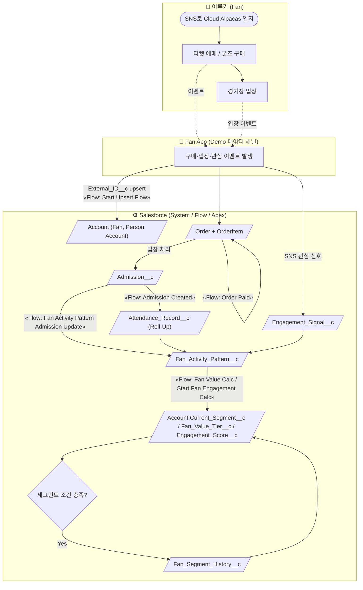
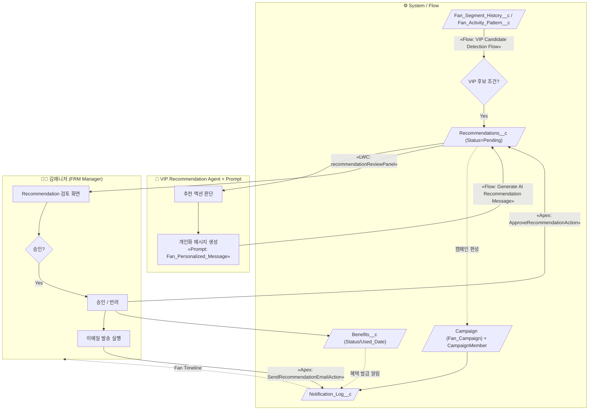
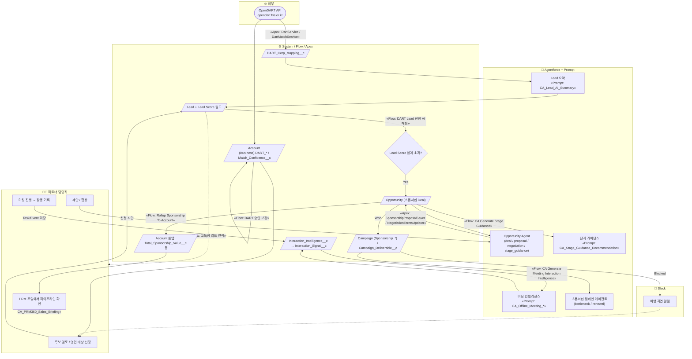

# 04. 프로세스 흐름도 — Cloud Alpacas

## Scope
3개 핵심 프로세스. 각 프로세스는 페르소나 Swimlane 으로 구분하고, 자동화 주체(Flow / Apex / Agentforce / Prompt / Platform Event)를 명시한다.

| 프로세스 | 페르소나 |
|---|---|
| P1. Fan 가입 → 데이터 축적 → Segment/Engagement 산출 | 이루키(Fan), Fan App, System(Flow/Apex) |
| P2. Fan 분석 → Recommendation → Campaign/Action 실행 | 김매니저(FRM Manager), System, VIP Recommendation Agent |
| P3. Sponsor 후보(B2B) → Fit 분석 → Lead → Opportunity → Sponsorship | 파트너 담당자, System, Opportunity/Campaign Agent, Slack |

**공통 도형 규칙:** `([시작/종료])` · `[업무 단계]` · `{의사결정}` · `[/데이터 객체/]` · 점선 = handoff/알림.

---

## P1. Fan 가입 → 데이터 축적 → Segment / Engagement

### As-Is (문제)
- 티켓 예매·입장·굿즈 구매·SNS 반응 데이터가 **서로 다른 채널에 흩어짐**.
- "몇 번 왔는지"와 "언제 왔는지"를 구분해 볼 수 없음. 팬 등급이 수기·주관적.

### To-Be (Salesforce)

**자동화 매핑**

| 단계 | 실제 Metadata | 유형 |
|---|---|---|
| 외부 데이터 진입 | `Start Upsert Flow` | AutoLaunched Flow (Sara) |
| 결제 완료 | `Order Paid`, `Order Membership Status Sync` | AutoLaunched Flow (Sara) |
| 입장 → 누적 집계 | `Admission Created` → `Attendance_Record__c` Roll-Up Summary | Flow + MD 롤업 |
| 활동 패턴 분석 | `Fan Activity Pattern Admission Update`, `Count_Goods_And_Season` | AutoLaunched Flow (Sara) |
| 팬 등급/점수 | `Fan Value Calc`, `Start Fan Engagement Calc` | AutoLaunched Flow (Sara) |
| 세그먼트 이력 | `Fan_Segment_History__c` 생성 | Flow |

**As-Is → To-Be 개선점:** 수기 등급 산정 → **입장/구매/관심 데이터 기반 Flow 자동 산출**. "횟수(`Total_Admissions__c`)"와 "시점(`First/Last_Admission_Date__c`)" 분리.

---

## P2. Fan 분석 → Recommendation → Campaign / Action

### As-Is (문제)
- 어떤 팬에게 무엇을 제안할지 담당자 감(感)에 의존. 제안한 혜택이 실제 혜택 레코드로 뒷받침되지 않음("말은 했는데 실체 없음").

### To-Be (Salesforce)

**자동화 매핑**

| 단계 | 실제 Metadata | 유형 |
|---|---|---|
| VIP 후보 감지 | `VIP Candidate Detection Flow -CA` | AutoLaunched Flow (Sara) |
| 추천 생성 | `VIP_Recommendation_Agent` (v1–v2), Topic `vip_recommendations` | GenAiPlanner |
| 후보 조회 | `GetPendingVipRecommendationsAction` | Apex Invocable |
| 메시지 생성 | `Generate AI Recommendation Message` Flow + Prompt `Fan_Personalized_Message` | Flow + Prompt Template (Sara) |
| 검토 UI | `recommendationReviewPanel`, `recommendationSegmentDashboard` | LWC (Sara) |
| 승인/발송 | `ApproveRecommendationAction`, `SendRecommendationEmailAction` | Apex Invocable |
| 팬 캠페인 | `Welcome / First Visit Guide / First Ticket / First Merchandise / Favorite Player Campaign Flow -CA` | AutoLaunched Flow (Sara) |
| 개인화 메시지 요청(이벤트) | Platform Event `Fan_Campaign_Msg_Request__e` → `Fan Campaign Personalized Msg Flow` | Platform Event 구독 Flow |
| 알림 이력 | `Notification_Log__c` (Fan Timeline) | Object |

**As-Is → To-Be 개선점:** 감에 의존한 제안 → **세그먼트/활동 데이터 + Agent 판단**. 제안↔혜택(`Benefits__c`)↔알림(`Notification_Log__c`) 레코드로 추적. 매니저는 **검토·승인만** (Human-in-the-loop).

---

## P3. Sponsor 후보(B2B) → Fit 분석 → Lead → Opportunity → Sponsorship

### As-Is (문제)
- 스폰서 후보 기업을 엑셀로 수집. "우리 팬덤과 맞는가"와 "계약 가능성"을 구분 안 함. 미팅 내용이 개인 메모로 흩어짐.

### To-Be (Salesforce)

**자동화 매핑**

| 단계 | 실제 Metadata | 유형 |
|---|---|---|
| DART 조회·매칭 | `DartService`, `DartMatchService`, `DartEnrichmentQueueable` / RemoteSite `opendart_fss` / Custom Setting `DART_Setting__c` | Apex + 통합 |
| 기업 정보 보강 | `DART 승인 보강`, `DART Lead 전환 AI매칭` | AutoLaunched Flow (Aaron) |
| Lead 스코어링 | `Lead_Score__c` … `Final_Lead_Score__c`, `Segment_Match__c` (18필드) + `LeadConvertPartnerContact` trigger | 필드 + Apex Trigger (Hyejune/Aaron) |
| Lead 요약 | Prompt `CA_Lead_AI_Summary` → `Lead.AI_Lead_Summary__c` | Prompt Template (Hyejune) |
| 후속 연락 | `고득점 리드 연락 Flow`, `협상 후속 연락 Flow`, `계약서 생성 Flow` | AutoLaunched Flow (Hyejune) |
| 활동 → Opportunity | `CA Update Opportunity Last Contact From Call/Email/Meeting`, `CA Update Opportunity Next Activity` | AutoLaunched Flow (Eunyeong) |
| 미팅 인텔리전스 | `CA Generate Meeting Interaction Intelligence` + Prompt `CA_Offline_Meeting_*` → `Interaction_Intelligence__c` → `Interaction_Signal__c` | Flow + Prompt (Eunyeong) |
| 딜 코칭 | `Opportunity_Agent` (v-latest), Topics: deal/proposal/negotiation/stage_guidance | GenAiPlanner (Eunyeong) |
| 제안/협상 | `SponsorshipProposalSaver`, `NegotiationTermsUpdater`, `OpportunityProposalContext` | Apex (Aaron→Eunyeong) |
| 스폰서십 캠페인 | `Campaign_Deliverable__c` + `Campaign Deliverable Blocked Slack Alert` / `Detect Due Date Push` | Flow (Rafael) + Slack |
| 캠페인 성과 | `Campaign 예상 매출 계산/동기화`, `갱신 캠페인 성과 요약 자동 생성` | AutoLaunched Flow (Rafael) |
| Account 롤업 | `Rollup Sponsorship To Account` (+On Delete), `Sync Account Latest Open Opportunity` | AutoLaunched Flow (Aaron) |
| PRM 포털 | `prm*` LWC 13종 + `Sales_Briefing__c` + Prompt `CA_PRM360_Sales_Briefing` + `PRM360SalesBriefingScheduler` | LWC + Apex + Prompt (Hyejune) |

**As-Is → To-Be 개선점:** 엑셀 후보 수집 → **DART API 자동 조회 + 매칭 점수**. Fan Fit(2단계, Agent) ↔ Lead Score(영업 활동 기반) 분리. 미팅 메모 → **구조화된 `Interaction_Intelligence__c`**. 이행 지연 → **Slack 자동 알림**.

---

## 5. Known Limitations / Verification Required

| 항목 | 상태 |
|---|---|
| Flow 트리거 조건·분기 상세 | 프로세스 관점 단순화. 정확한 entry criteria 는 Flow Builder 확인 필요 |
| Opportunity Agent 활성 버전 | v1–v23 중 활성 1개 (미확정) — 다이어그램은 "v-latest" 로 표기 |
| Fan App ↔ Salesforce 연동 방식 | `Fan_App_API_Access` (License `SalesforceAPIIntegrationPsl`) + `External_ID__c` upsert — REST API 추정, 실제 클라이언트 코드 미확인 |
| Slack 채널 ID | `04_DEMO.md` 기재값(`C0BSDEZHUBV` 등) 미검증 — Flow 내 실제 채널 확인 필요 |
| `04_DEMO.md` 시나리오 | 현재 3,441 bytes (축약본) — 상세 시나리오 대조 미완 |
