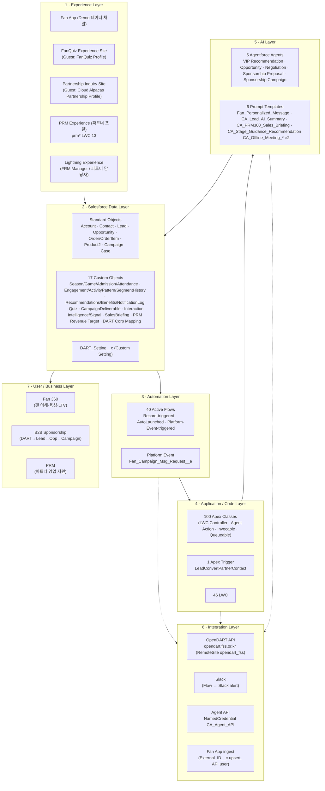
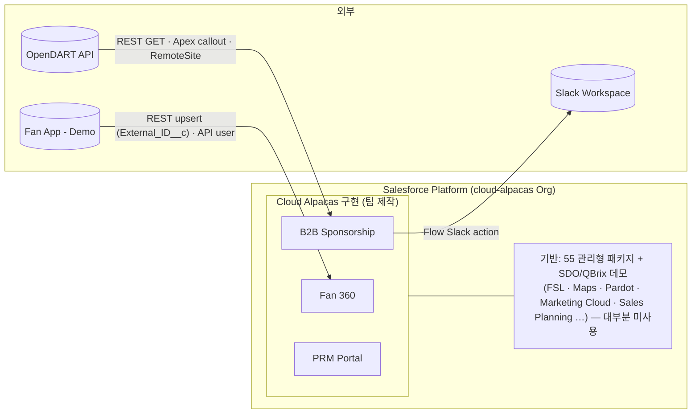

# 05. 시스템 아키텍처 — Cloud Alpacas

## Purpose
Cloud Alpacas가 사용하는 Salesforce 앱 영역과 외부 시스템 연동 구조, 각 Layer의 책임을 한눈에 파악한다. "기술을 많이 썼다"가 아니라 **각 Layer가 무엇을 책임지는가**를 설명한다.

## Scope
2026-08-31 현재 `cloud-alpacas` Org (`00Dbm00000tkYqDEAU`, Enterprise, Production)에 **실제 구현된** Cloud Alpacas 레이어
## 실제 구현 수치 (팀 제작분)

| 자산 | 수 | 전체 Org 대비 |
|---|---|---|
| Custom Object | **17** | 무네임스페이스 149개 중 |
| Custom Setting | 1 (`DART_Setting__c`) | — |
| Platform Event | 1 (`Fan_Campaign_Msg_Request__e`) | — |
| Active Flow | **40** | 전체 Active 308개 중 |
| Apex Class | **100** | 전체 2,623개 중 |
| Apex Trigger | **1** (`LeadConvertPartnerContact`) | 전체 214개 중 |
| LWC | **46** | 전체 491개 중 |
| Agentforce Agent (GenAiPlannerDefinition) | **5** | — |
| Prompt Template | **6** | — |
| RecordType | **12** | — |
| Permission Set (업무용) | **17** (+6 Agent 자동생성) | 전체 1,210개 중 |
| Profile (Guest) | 2 (`FanQuiz`, `Cloud Alpacas Partnership`) | — |

---

## 1. Layer 개요도

---

## 2. Layer별 책임

### 1 · Experience Layer — "누가 어디서 접근하는가"

| 구성요소 | 책임 | 실제 Metadata |
|---|---|---|
| **Fan App** | Demo용 데이터 생성 채널. 티켓/입장/굿즈/관심 이벤트를 Salesforce로 전달. **업무 UI 아님** | `Fan_App_API_Access` PS (License `SalesforceAPIIntegrationPsl`) |
| **FanQuiz Site** | 팬 퀴즈 응모 (발표 참여 이벤트, P1) | Guest `FanQuiz Profile`, LWC `liveFanQuizEntry`/`liveFanQuizReveal`, Apex `QuizEntrySubmitController`/`LiveFanQuizRevealController`, Object `Quiz_Entry__c` |
| **Partnership Inquiry Site** | 스폰서십 문의 접수 | Guest `Cloud Alpacas Partnership Profile`, LWC `partnershipInquiry`, Apex `PartnershipInquiryController` |
| **PRM 파트너 포털** | 파트너 담당자용 대시보드 (매출·파이프라인·브리핑·할 일) | LWC `prm*` 13종, `leadAiSummaryCard`, `Sales_Briefing__c` |
| **Lightning Experience** | FRM Manager·파트너 담당자 내부 업무 화면 | Custom Tab 19, App(미확인), LWC 33종 |

### 2 · Salesforce Data Layer — "무엇을 저장하는가" (→ `01_ERD.md`)

| 영역 | 책임 |
|---|---|
| **Standard Objects** | 표준 개념 재사용 — 팬/기업(Account), 선수/담당자(Contact), 스폰서 후보(Lead), 딜(Opportunity), 구매(Order/OrderItem), 상품(Product2), 캠페인(Campaign), 문의(Case). RecordType 12개로 B2C/B2B 분기 |
| **17 Custom Objects** | 표준에 없는 개념 — 시즌/경기/입장, 활동패턴/세그먼트 이력, 추천/혜택/알림, 미팅 인텔리전스, 스폰서십 이행, PRM |
| **`DART_Setting__c`** | OpenDART 인증키 (Hierarchy Custom Setting) |
| 설계 원칙 | **Standard First, Custom When Needed** (Decision 003). 집계는 MD Roll-Up(`Attendance_Record__c`, `Campaign`) 우선 |

### 3 · Automation Layer — "언제 자동으로 반응하는가"

| 유형 | 책임 | 예 |
|---|---|---|
| Record-triggered Flow | 레코드 저장/삭제 시 후속 처리 | `Admission Created`, `CA Update Opportunity Last Contact From Meeting` |
| AutoLaunched Flow | 다른 Flow/Apex/Agent가 호출하는 로직 | `Fan Value Calc`, `Rollup Sponsorship To Account` |
| Platform-Event Flow | 비동기 요청 처리 | `Fan Campaign Personalized Msg Flow` ← `Fan_Campaign_Msg_Request__e` |
| 원칙 | **Flow 우선, Trigger 최소** (Decision 008) — Trigger는 Lead 전환 보조 1개뿐 |

### 4 · Application / Code Layer — "복잡한 로직·화면 부품"

| 유형 | 책임 |
|---|---|
| Apex Controller | LWC 데이터 제공 (`@AuraEnabled cacheable=true` 조회 / imperative 저장) |
| Apex Invocable / Agent Action | Flow·Agent가 호출하는 액션 (`ApproveRecommendationAction`, `DealContext`, `FindSponsorshipPackage`) |
| Apex Queueable | 비동기 외부 호출 (`DartEnrichmentQueueable`, `DartMatchQueueable`) |
| Apex Trigger | `LeadConvertPartnerContact` (Lead 전환 시 Partner Contact 보정) |
| LWC | Fan 360 화면, 추천 검토, Opportunity Agent 채팅, PRM 포털 위젯 |

### 5 · AI Layer — "판단·생성을 돕는다"

| 구성요소 | 책임 |
|---|---|
| **VIP Recommendation Agent** | VIP 후보 팬에게 Next Best Action 추천 (Sara) |
| **Opportunity Agent** | 영업 담당자 코파일럿 — 딜 컨텍스트/제안/협상/단계 가이던스 (Eunyeong, v1–v23 누적) |
| **Negotiation Assistant / Sponsorship Proposal Assistant** | 협상 조건·제안서 생성 (Aaron) |
| **스폰서십 캠페인 에이전트** | 캠페인 병목 탐지·갱신 리포트 (Rafael) |
| **Prompt Template 6** | 개인화 메시지·Lead 요약·세일즈 브리핑·단계 가이던스·미팅 인텔리전스 생성 |
| 패턴 | Agent/Prompt 출력은 항상 **레코드(`Recommendations__c`, `Interaction_Intelligence__c`, `Sales_Briefing__c`)로 저장** → 추적 가능. 매니저는 검토·승인 (Human-in-the-loop) |

### 6 · Integration Layer — "외부와 어떻게 연결되는가"

| 연동 | 방식 | 실제 Metadata | 상태 |
|---|---|---|---|
| **OpenDART API** (금융감독원 전자공시) | REST GET, Apex HTTP callout | `DartService` → `https://opendart.fss.or.kr/api/company.json`, `fnlttSinglAcnt.json`; RemoteSite `opendart_fss` (활성); key = `DART_Setting__c.Api_Key__c` | ✅ 확인 |
| **Slack** | Flow → Slack 액션 | `Campaign Deliverable Blocked Slack Alert` 등; `sfdc_slack` PS (Session) | ✅ 존재 (채널 ID 미검증) |
| **Agent API** | Named Credential | `CA_Agent_API` (`https://api.salesforce.com`, ExternalCredential `CA_Agent_API_Cred`, SecuredEndpoint) | ✅ 확인 (사용처 상세 미확인) |
| **Fan App → Salesforce** | API upsert (`External_ID__c`) | `Fan_App_API_Access` PS; `Start Upsert Flow` | ⚠️ 클라이언트 코드 미확인 — 연동 방식 REST 추정 |
| Marketing Cloud / Pardot / Data Cloud | — | 패키지 설치됨 | **Out of Scope** (팀 미사용) |
| 결제(PG) | — | 없음 (`Order.Payment_Status__c` 필드로만 표현) | **Out of Scope** |

### 7 · User / Business Layer — "무엇을 달성하는가"

| 도메인 | Business 목표 | 지원 Layer |
|---|---|---|
| **Fan 360** | 신규 팬 이해 → 개인화 액션 → 충성 팬 육성 → Fan LTV ↑ | Data(11 Custom Obj) + Automation(17 Flow) + AI(VIP Agent) + Experience(Fan App/Quiz) |
| **B2B Sponsorship** | 팬덤 광고가치 발견 → DART 기업 매칭 → Lead → Opportunity → 스폰서십 계약·이행 | Data(6 Custom Obj) + Automation(15 Flow) + AI(3 Agent) + Integration(DART/Slack) |
| **PRM** | 파트너 담당자 영업 생산성 (브리핑·파이프라인·목표) | Experience(PRM 포털) + AI(Sales Briefing Prompt) + Data(`Sales_Briefing__c`) |

---

## 3. 시스템 경계

---

## 4. Known Limitations / Verification Required

| 항목 | 상태 |
|---|---|
| Fan App 실제 연동 프로토콜/호스트 | 미확인 (`External_ID__c` upsert 로 추정) |
| `CA_Agent_API` Named Credential 실제 호출 코드 | 사용처 미확정 (Agent/Models API 호출용 추정) |
| Slack 채널·앱 구성 | Flow 내 채널 ID 미검증 |
| CustomApplication (App) 접근 구조 | PS XML 에 없음 — Profile 기반 추정, 미조회 |
| Experience Site(Network/DigitalExperienceBundle) 상세 | 미 retrieve — Guest Profile 존재만 확인 |
| Opportunity Agent 활성 버전 | v1–v23 중 1개 (미확정) |
| AccountPlan 표준 기능 활성 여부 | 미확인 (`Partnership_Team_Access` PS 로 필드 권한만 확인) |
| Data Cloud / Marketing Cloud / Pardot | 패키지 설치됨, 팀 구현 없음 → Out of Scope |
