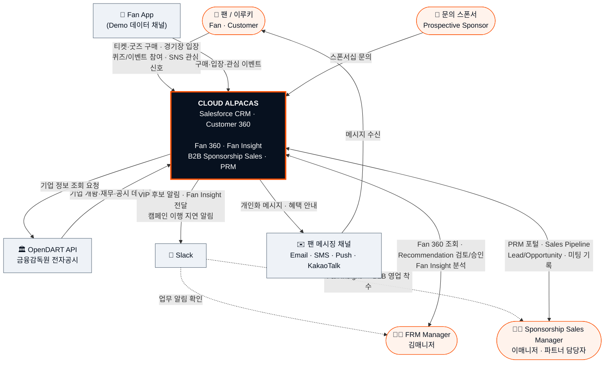
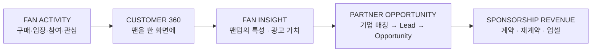

# Cloud Alpacas — Context Diagram

> 이 문서는 **Cloud Alpacas Salesforce 시스템의 경계(boundary)** 를 정의한다.
> "시스템 내부가 어떻게 만들어졌는가"가 아니라 **"이 시스템이 누구/무엇과 연결되어 있고,
> 각 외부 주체와 무엇을 주고받는가"** 를 보여준다.
>
> Salesforce 내부 구현(Object·Flow·Apex·LWC·Agentforce·Layer)은 **의도적으로 하나의
> Black Box 로 표현**한다. 내부 구조는 `05_ARCHITECTURE.md` 의 영역이다.
> 두 문서는 서로 다른 abstraction level 을 유지하며 보완 관계다(§6 참고).

---

## 1. Purpose

Context Diagram 의 목적은 **Cloud Alpacas 가 외부 세계에서 어떤 역할을 하는지, 그리고
어디까지가 우리 시스템의 책임인지를 한 장으로 합의**하는 것이다.

- 시스템 경계를 명확히 한다 — 무엇이 우리 시스템이고 무엇이 아닌가.
- 외부 사용자·외부 시스템·외부 데이터의 목록을 확정한다.
- 각 외부 접점에서 **무엇이(business 수준) 오가는가**를 보여준다.
- 실제 구현/프로젝트 범위에서 **확인되는 관계만** 그린다. 시나리오상 존재할 법한
  연동을 실제 연결된 것처럼 추가하지 않는다(§7).

이 문서는 API endpoint·field mapping·트리거 조건 같은 상세로 내려가지 않는다.
그 수준은 `05_ARCHITECTURE.md` · `04_PROCESS_FLOW.md` · `01_ERD.md` 가 다룬다.

---

## 2. System Boundary

중앙에는 단 하나의 시스템 경계를 둔다.

```
┌─────────────────────────────────────────────┐
│                CLOUD ALPACAS                 │
│        Salesforce CRM · Customer 360         │
│                                             │
│   Fan 360 · Fan Insight ·                    │
│   B2B Sponsorship Sales · PRM                │
└─────────────────────────────────────────────┘
```

- **경계 안쪽**: `cloud-alpacas` Org 위에 팀이 구현한 Cloud Alpacas 애플리케이션 전체.
  외부에서 보이는 역할은 네 가지다 — 팬을 한 화면에서 보는 **Fan 360**, 팬덤의 특성을
  읽어내는 **Fan Insight**, 팬덤 가치를 매출로 잇는 **B2B Sponsorship Sales**,
  파트너 영업을 지원하는 **PRM**.
- **경계 위(edge)**: FanQuiz Experience Site, Partnership Inquiry Site 등 Salesforce
  플랫폼 위에서 동작하는 공개 채널. 이들은 **시스템 자체의 얼굴**이며, 외부 행위자는
  이 채널을 **사용하는 팬 / 문의 기업**이다.
- **경계 바깥**: §4 의 외부 사용자·시스템·데이터.

이 Context Diagram 은 아래 요소를 **그리지 않는다** (모두 `05_ARCHITECTURE.md` 영역):

> Person Account · Contact · Lead · Opportunity · Custom Object 목록 · Flow · Apex ·
> Trigger · LWC · Agentforce Agent · Prompt Template · Record Type · Permission Set ·
> Platform Event · Salesforce 내부 Layer(Experience / Data / Automation / Code / AI /
> Integration).

---

## 3. Context Diagram

> **발표·문서용 고해상도 이미지**: [`08_CONTEXT_DIAGRAM/context_diagram.svg`](08_CONTEXT_DIAGRAM/context_diagram.svg)
> (Source of Truth) · [`08_CONTEXT_DIAGRAM/context_diagram.png`](08_CONTEXT_DIAGRAM/context_diagram.png)
> (1920×1080). 재생성: `python3 08_CONTEXT_DIAGRAM/_generator.py` (표준 라이브러리만).
> 이미지는 아래 Mermaid 와 동일한 내용을 hub-and-spoke 로 표현한다 —
> `05_ARCHITECTURE` 의 Layer 다이어그램과 시각적으로 혼동되지 않도록 의도적으로 다른 구도다.

### 3.1 System Context



### 3.2 Business Context (얇게)

기술 연결만이 아니라, Cloud Alpacas 의 핵심 비즈니스 흐름이 외부 세계와 어떻게 이어지는지를
보조 문맥으로만 표현한다. **상세 Process Flow 가 아니다** — 그 수준은 `04_PROCESS_FLOW.md`.



> 관통 원리: **B2C Fan Activity → Fan 360 Insight → B2B Sponsorship Decision**
> (`08_PROJECT_BRIEF.md`, `00_STORY.md` §8.3)

---

## 4. External Actors & Systems

| # | 외부 주체 | 유형 | 시스템과의 관계 | 근거 | 상태 |
|---|---|---|---|---|---|
| 1 | **팬 / 이루키** (Fan · Customer) | 사용자 | 티켓·굿즈 구매, 경기장 입장, 퀴즈/이벤트 참여, SNS 관심 신호를 만들고 → 개인화 메시지·혜택 안내를 받는다 | `00_STORY.md` §4–7, `04_PROCESS_FLOW.md` P1 | ✅ |
| 2 | **Fan App** (Demo 데이터 채널) | 외부 시스템 | 팬의 구매·입장·관심 이벤트를 Salesforce 로 유입시키는 **입력 전용** 채널. 업무 UI 아님 | `05_ARCHITECTURE.md` §2-1·§6, `04_PROCESS_FLOW.md` P1 | ✅ (연동 프로토콜 추정) |
| 3 | **문의 스폰서** (Prospective Sponsor) | 사용자 | Partnership Inquiry Site 를 통해 스폰서십 문의를 접수 | `05_ARCHITECTURE.md` §2-1 (Guest `Cloud Alpacas Partnership Profile`, `partnershipInquiry` LWC) | ✅ |
| 4 | **OpenDART API** (금융감독원 전자공시) | 외부 데이터 | 스폰서 후보 기업의 개황·재무·공시 데이터를 제공. 기업 정보 enrichment / Fan-Fit matching 의 **Primary Data Source** | `05_ARCHITECTURE.md` §6 (RemoteSite `opendart_fss`), `00_STORY.md` §8.3 (Decision 020), `04_PROCESS_FLOW.md` P3 | ✅ |
| 5 | **FRM Manager** (김매니저) | 사용자 | Fan 360 조회, Recommendation 검토·승인, Fan Insight 분석 (Human-in-the-loop) | `00_STORY.md` §4, `04_PROCESS_FLOW.md` P2, `CLAUDE.md` §4 | ✅ |
| 6 | **Sponsorship Sales Manager** (이매니저) · 파트너 담당자 | 사용자 | PRM 포털에서 Sales Pipeline·Lead·Opportunity 관리, 미팅 기록, 제안·협상 판단 | `00_STORY.md` §4 [P2]·§8, `04_DEMO.md` Scene 4–9, `05_ARCHITECTURE.md` §2-1 (PRM 포털) | ✅ |
| 7 | **Slack** | 외부 시스템 | 시스템이 내보내는 **출력 전용** 알림 채널 — VIP 후보 알림, B2C→B2B Fan Insight 전달, 캠페인 이행 지연 알림 | `05_ARCHITECTURE.md` §6 (`sfdc_slack` PS), `03_SYSTEM.md` §4.2–4.3, `04_DEMO.md` Scene 3 | ✅ (채널 ID 미검증) |
| 8 | **팬 메시징 채널** (Email · SMS · Push · KakaoTalk) | 외부 시스템 | 시스템이 실행하는 고객 커뮤니케이션 — 개인화 메시지·혜택 안내가 팬에게 전달되는 경로 | `03_SYSTEM.md` §4.3 (`Notification_Log__c.Channel__c`), `04_PROCESS_FLOW.md` P2 | ✅ (실제 이메일 전달은 §7 제약) |

**의도적으로 제외한 접점** — §7 참고: Zoom, Agent/Models API, Marketing Cloud / Data Cloud / Pardot, 결제 PG.

---

## 5. Key Data / Interaction Flows

각 외부 주체와 중앙 시스템 사이에 **무엇이 오가는가**만 짧게 표시한다.
방향과 payload 는 business 수준이며, endpoint·필드 단위로 내려가지 않는다.

**팬 / 이루키**
- 팬 → `티켓·굿즈 구매 / 경기장 입장 / 퀴즈·이벤트 참여 / SNS 관심 신호` → Cloud Alpacas
- Cloud Alpacas → `개인화 메시지·혜택 안내` → (팬 메시징 채널) → 팬

**Fan App**
- Fan App → `구매·입장·관심 이벤트` → Cloud Alpacas *(입력 전용, 되돌아가는 흐름 없음)*

**문의 스폰서**
- 문의 스폰서 → `스폰서십 문의` → Cloud Alpacas *(입력 전용)*

**OpenDART API**
- Cloud Alpacas → `기업 정보 조회 요청` → OpenDART
- OpenDART → `기업 개황·재무·공시 데이터` → Cloud Alpacas

**FRM Manager (김매니저)**
- 김매니저 ↔ Cloud Alpacas : `Fan 360 조회 · Recommendation 검토/승인 · Fan Insight 분석`

**Sponsorship Sales Manager (이매니저) · 파트너 담당자**
- 이매니저 ↔ Cloud Alpacas : `PRM 포털 · Sales Pipeline · Lead/Opportunity 관리 · 미팅 기록 · 제안/협상`

**Slack**
- Cloud Alpacas → `VIP 후보 알림 / Fan Insight 전달 / 캠페인 이행 지연 알림` → Slack → (담당자 확인)

**팬 메시징 채널**
- Cloud Alpacas → `개인화 메시지 (Email/SMS/Push/KakaoTalk)` → 팬

---

## 6. Context Diagram vs System Architecture

두 문서는 **같은 시스템을 서로 다른 높이에서** 본다. 하나가 다른 하나를 대체하지 않는다.

### Context Diagram — *"What surrounds the system?"*

- 시스템 경계 (Cloud Alpacas = 하나의 Black Box)
- 외부 사용자 · 외부 시스템 · 외부 데이터
- 시스템과 외부 세계 사이의 주요 입출력
- 시스템이 외부 세계에서 맡은 역할

### System Architecture — *"How is the system built?"* (`05_ARCHITECTURE.md`)

- Experience Layer / Salesforce Data Layer / Automation Layer
- Application(Apex · LWC) Layer / AI(Agentforce · Prompt) Layer / Integration Layer
- 내부 컴포넌트 구성과 Layer 간 데이터 흐름
- 실제 구현 수치 (Custom Object 17 · Active Flow 40 · Apex 100 · LWC 46 · Agent 5 …)

### 한 문장으로

| | 질문 |
|---|---|
| **Context Diagram** | **WHO / WHAT IS AROUND US?** |
| **System Architecture** | **HOW ARE WE BUILT INSIDE?** |

> 그래서 이 문서에는 `05_ARCHITECTURE.md` 의 Layer 그림을 축소·복제한 다이어그램이 없다.
> Salesforce 내부는 여기서 언제나 하나의 상자다.

---

## 7. Architecture Notes / Assumptions

이 문서의 목적은 "예쁜 그림"이 아니라 **시스템 경계를 정확하게 정의**하는 것이다.
아래는 경계를 그릴 때 내린 판단과, 사람이 확인해야 하는 부분이다.

| 항목 | 판단 / 상태 |
|---|---|
| **Salesforce 내부** | 의도적으로 Black Box. 내부 구조는 `05_ARCHITECTURE.md` 가 단독으로 다룬다. |
| **FanQuiz / Partnership Inquiry Site** | Salesforce Experience Cloud 위의 시스템 자체 공개 채널(경계의 edge). 외부 행위자는 이를 사용하는 **팬 / 문의 기업**으로 표현했다. |
| **Fan App 연동 프로토콜** | 미확인. `Fan_App_API_Access` PS + `External_ID__c` upsert 근거로 REST 로 **추정** (`05_ARCHITECTURE.md` §4, `04_PROCESS_FLOW.md` §5). |
| **Slack 채널 구성** | 연동 존재는 확인(`sfdc_slack` PS, `Campaign_Deliverable__c.Pending_Slack_Message__c`, Flow Slack 액션). 실제 채널 ID 는 미검증 (`04_DEMO.md` 기재값 대조 필요). |
| **Zoom** | `04_DEMO.md` Scene 6 이 "Zoom 대화 → 자동 Activity 기록"을 언급하나, RemoteSite · NamedCredential · Apex 등 **통합 메타데이터가 확인되지 않음**. Context Diagram 에서 **제외**한다. 실제 연동이 확인되면 외부 시스템으로 추가. |
| **Agent / Models API** (`CA_Agent_API`, `api.salesforce.com`) | Salesforce **플랫폼 내부 API** 호출로 추정(SecuredEndpoint, 사용처 미확정). Agentforce 는 중앙 시스템 내부이므로 **외부 주체로 그리지 않는다** (`05_ARCHITECTURE.md` §6). |
| **팬 이메일 실제 전달** | Trial org 에서 개인 웹메일 도메인 SPF/DKIM 인증이 구조적으로 불가 — 실제 발송 테스트는 별도 서비스로 진행 (`CLAUDE.md` §11). Context 상 "메시징 채널"은 유지. |
| **기업 DB (~100개)** | Salesforce 에 저장하지 않음. Primary Source = OpenDART Open API (Decision 020). CSV 는 개발/테스트용 대체 입력. |
| **Out of Scope** | Marketing Cloud · Data Cloud · Pardot (패키지만 설치, 팀 미구현) / 결제 PG (없음, `Order.Payment_Status__c` 필드로만 표현) — `05_ARCHITECTURE.md` §6. |
| **계약 이후 성과 분석 / 장기 재계약** | Story 수준에서만 유효, 이번 구현 범위 밖 (`00_STORY.md` §8.4, `04_DEMO.md` Scene 9). 외부 접점 없음. |

---

### 근거 문서

- `00_STORY.md` — Business Goal · Pain Point · Persona · Phase 2 Story
- `03_SYSTEM.md` §4 — Slack 알림 vs Notification_Log 구분, Flow Trigger → Action
- `04_DEMO.md` — Demo Scene 1–9 (팬 참여 → Slack handoff → d'Alba → Closed Won)
- `04_PROCESS_FLOW.md` — P1 Fan 데이터 / P2 Recommendation / P3 Sponsorship
- `05_ARCHITECTURE.md` (+ `05_ARCHITECTURE/README.md`) — 내부 7 Layer, Integration 표, 시스템 경계
- `08_PROJECT_BRIEF.md` — 관통 원리 (B2C Fan Activity → Fan 360 Insight → B2B Sponsorship Decision)
- `CLAUDE.md` — 프로젝트 세계관, MVP 범위, 실무 제약
- Org metadata — `remoteSiteSettings/opendart_fss`, `namedCredentials/CA_Agent_API`, `Campaign_Deliverable__c.Pending_Slack_Message__c`
