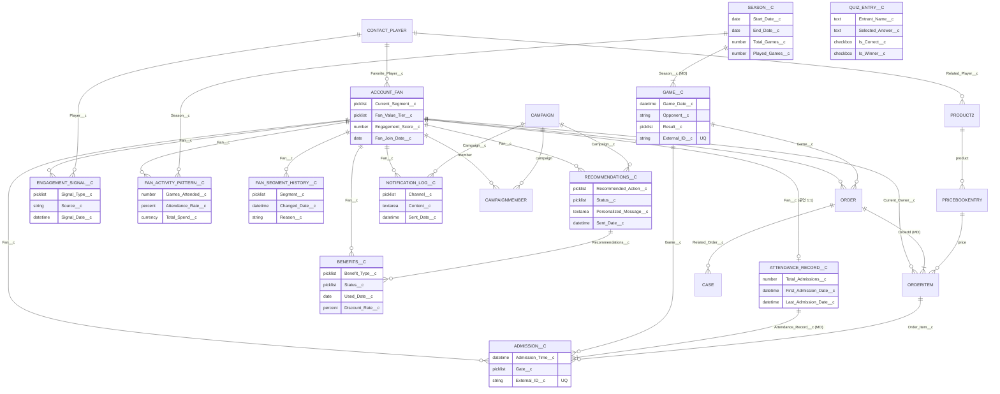
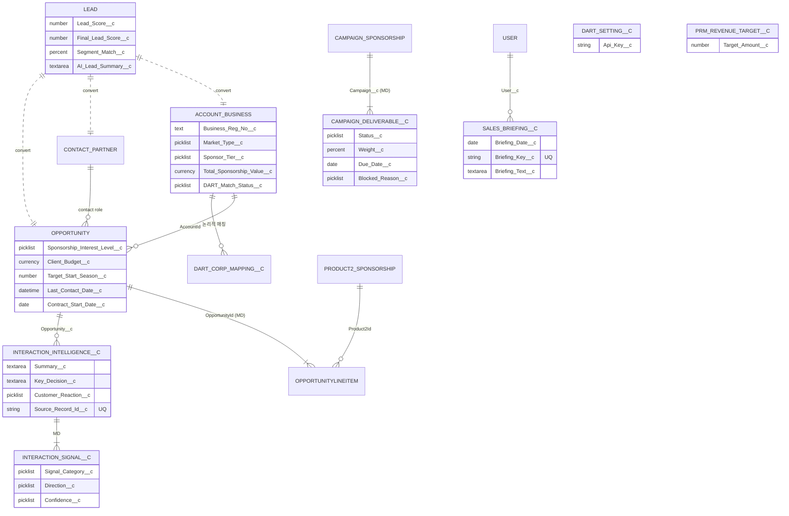

# ERD_OBJECT_LIST — Cloud Alpacas

> **Source of Truth: Salesforce Org Metadata — 2026-08-31**
> 이 문서는 `03_SYSTEM_ORG.md` 만을 근거로 작성한다. 기존 CloudAlpacas 문서의 설계는 근거로 쓰지 않는다.
> ERD Entity에는 **Object만** 넣는다 — Flow / Apex / LWC / Agentforce / Prompt Template 제외.
> API Name은 실제 Org 기준: `Recommendations__c`(NOT `Recommendation__c`), `Benefits__c`(NOT `Benefit__c`).
> 관계 타입: **MD**=Master-Detail(cascade). **L!**=필수 Lookup(restrict delete). **L**=선택 Lookup.
> PK는 전부 표준 `Id` (18-char). FK는 아래 Relationship 컬럼.
>
> **Rev.2 정정 (2026-08-31):** `DART_Setting__c` 는 **Hierarchy Custom Setting** → ERD Entity 아님(§1.3 로 이동). ERD Custom Object = **17개**. `DART_Corp_Mapping__c` 는 field 4개 보유(`Corp_Code__c`/`Corp_Name__c`/`Corp_Name_Eng__c`/`Stock_Code__c`).

---

## 1. ERD 포함 Object

### 1.1 Custom Object (18) — Cloud Alpacas 제작

| Object | API Name | 구분 | Name 필드 | PK | 주요 FK (관계) |
|---|---|---|---|---|---|
| Season | `Season__c` | B2C | Text | Id | — (부모) |
| Game | `Game__c` | B2C | AutoNumber | Id | `Season__c` → Season **MD** |
| Admission | `Admission__c` | B2C | AutoNumber | Id | `Attendance_Record__c` **MD**, `Fan__c`→Account **L!**, `Game__c`→Game **L!**, `Order_Item__c`→OrderItem **L!** |
| Attendance Record | `Attendance_Record__c` | B2C | AutoNumber | Id | `Fan__c`→Account **L!** |
| Engagement Signal | `Engagement_Signal__c` | B2C | AutoNumber | Id | `Fan__c`→Account **L!**, `Player__c`→Contact **L** |
| Fan Activity Pattern | `Fan_Activity_Pattern__c` | B2C | AutoNumber | Id | `Fan__c`→Account **L!**, `Season__c`→Season **L** |
| Fan Segment History | `Fan_Segment_History__c` | B2C | AutoNumber | Id | `Fan__c`→Account **L!** |
| Fan Recommendation | `Recommendations__c` | B2C | AutoNumber | Id | `Fan__c`→Account **L!**, `Campaign__c`→Campaign **L** |
| Benefits | `Benefits__c` | B2C | AutoNumber | Id | `Fan__c`→Account **L!**, `Recommendations__c`→Recommendation **L** |
| Notification Log | `Notification_Log__c` | B2C | AutoNumber | Id | `Fan__c`→Account **L!**, `Campaign__c`→Campaign **L** |
| Quiz Entry | `Quiz_Entry__c` | B2C (Event) | Text | Id | 없음 (독립) |
| Campaign Deliverable | `Campaign_Deliverable__c` | B2B | AutoNumber | Id | `Campaign__c` → Campaign **MD** |
| Interaction Intelligence | `Interaction_Intelligence__c` | B2B | AutoNumber | Id | `Opportunity__c`→Opportunity **L** |
| Interaction Signal | `Interaction_Signal__c` | B2B | AutoNumber | Id | `Interaction_Intelligence__c` → **MD** |
| Sales Briefing | `Sales_Briefing__c` | B2B | AutoNumber | Id | `User__c`→User **L** |
| PRM Revenue Target | `PRM_Revenue_Target__c` | B2B | Text | Id | 없음 (미구현) |
| DART 기업 매핑 | `DART_Corp_Mapping__c` | B2B | Text | Id | 없음 (Account와 논리적 매핑) |
| DART 설정 | `DART_Setting__c` | B2B | Text | Id | 없음 |

### 1.2 Standard Object (ERD 등장, 12)

| Object | API Name | 구분 | ERD 역할 | 팀 RecordType |
|---|---|---|---|---|
| Account | `Account` | B2C+B2B | Fan(Person Account) / Business / Own Organization | `Fan`, `Own_Organization` |
| Contact | `Contact` | B2C+B2B | Player / Partner Contact | `Player` |
| Lead | `Lead` | B2B | 스폰서십 Lead (전환 전) | — (SDO RT 사용) |
| Opportunity | `Opportunity` | B2B | 스폰서십 Deal | — (SDO RT 사용) |
| OpportunityLineItem | `OpportunityLineItem` | B2B | Deal–Product 정션 | — |
| Campaign | `Campaign` | B2C+B2B | Fan 캠페인 / 스폰서십 캠페인 | `Fan_Campaign`, `Sponsorship_Collaboration`, `Sponsorship_Prospecting`, `Sponsorship_Renewal` |
| CampaignMember | `CampaignMember` | B2C | 발송/참여 대상 정션 | — |
| Case | `Case` | B2C | Fan 문의 | `Fan_Case` |
| Order | `Order` | B2C | 티켓/굿즈/멤버십 구매 | — (SDO RT 사용) |
| OrderItem | `OrderItem` | B2C | 구매 라인 (좌석/굿즈) | — |
| Product2 | `Product2` | B2C+B2B | Ticket/Season Pass/Membership/Goods/Sponsorship Package | `Ticket`, `Season_Pass`, `Membership`, `Goods`, `Sponsorship_Package` |
| Pricebook2 / PricebookEntry | `Pricebook2` / `PricebookEntry` | B2C | 가격 정책 | — |
| User | `User` | 지원 | Staff (Sales Briefing 대상) | — |

> `AccountPlan`(표준, Aaron 08-31 14필드)은 **잠정 포함 보류** — 표준 Account Plan 기능 활성 상태 확인 후 편입.

### 1.3 ERD 제외

| 대상 | 이유 |
|---|---|
| `Recommendation__c` (단수), `User__c` | Org에 실존하지 않음 (phantom Tooling row) |
| `Fan_Campaign_Msg_Request__e` | Platform Event (Object 아님) |
| `Benefit` (표준) | 커스텀 `Benefits__c`와 혼동 방지 — ERD의 "혜택"은 `Benefits__c` |
| `Quote`, `QuoteLineItem`, `Contract`, `Asset` | CA 커스텀 필드/RecordType 없음 = 스캐폴딩만 |
| `Task`, `Event` (Activity) | 데이터 모델 아님. `Interaction_Intelligence__c`가 파생 (03_SYSTEM_ORG §6.2) |
| `SDO_*`, `xDO_*`, `CGC_*`, `DBM_*`, 패키지 Object | 데모 스캐폴딩 / 관리형 패키지 (팀 제작 아님) |

---

## 2. Object별 핵심 Field (ERD 표기용)

| Object | 핵심 Field (FK 제외) |
|---|---|
| `Season__c` | `Start_Date__c`, `End_Date__c`, `Total_Games__c`, `Played_Games__c` |
| `Game__c` | `Game_Date__c`, `Opponent__c`, `Result__c`, `Status__c`, `Home_Away__c`, `External_ID__c`⚿ |
| `Admission__c` | `Admission_Time__c`, `Gate__c`, `External_ID__c`⚿ |
| `Attendance_Record__c` | `Total_Admissions__c`, `First_Admission_Date__c`, `Last_Admission_Date__c`, `External_ID__c`⚿ |
| `Engagement_Signal__c` | `Signal_Type__c`, `Source__c`, `Signal_Date__c`, `External_ID__c`⚿ |
| `Fan_Activity_Pattern__c` | `Games_Attended__c`, `Attendance_Rate__c`, `Goods_Purchases__c`, `Total_Spend__c`, `Analyzed_Date__c` |
| `Fan_Segment_History__c` | `Segment__c`, `Changed_Date__c`, `Reason__c`, `External_ID__c`⚿ |
| `Recommendations__c` | `Recommended_Action__c`, `Status__c`, `Reason__c`, `Personalized_Message__c`, `Sent_Date__c`, `External_ID__c`⚿ |
| `Benefits__c` | `Benefit_Type__c`, `Status__c`, `Issued_Date__c`, `Used_Date__c`, `Expiration_Date__c`, `Discount_Rate__c`, `Min_Purchase_Amount__c`, `Badge_Label__c`, `External_ID__c`⚿ |
| `Notification_Log__c` | `Channel__c`, `Content__c`, `Sent_Date__c`, `External_ID__c`⚿ |
| `Quiz_Entry__c` | `Entrant_Name__c`, `Selected_Answer__c`, `Is_Correct__c`, `Is_Winner__c` |
| `Campaign_Deliverable__c` | `Status__c`, `Weight__c`, `Due_Date__c`, `Completed_Date__c`, `Blocked_Reason__c`, `Evidence_URL__c` |
| `Interaction_Intelligence__c` | `Summary__c`, `Key_Decision__c`, `Concerns_Objections__c`, `Customer_Reaction__c`, `Follow_Up__c`, `Source_Type__c`, `Source_Record_Id__c`⚿ |
| `Interaction_Signal__c` | `Signal_Category__c`, `Signal_Type__c`, `Direction__c`, `Confidence__c`, `Evidence__c` |
| `Sales_Briefing__c` | `Briefing_Date__c`, `Briefing_Key__c`⚿, `Briefing_Text__c` |
| `PRM_Revenue_Target__c` | `Target_Amount__c` |
| `DART_Setting__c` | `Api_Key__c` |
| `Account` (Fan) | `Current_Segment__c`, `Engagement_Level__c`, `Engagement_Score__c`, `Fan_Value_Tier__c`, `Fan_Join_Date__c`, `Membership_Status__c`, `*_Opt_In__c` |
| `Account` (Business) | `Business_Reg_No__c`, `Corp_Name_Eng__c`, `Market_Type__c`, `Sponsor_Tier__c`, `Total_Sponsorship_Value__c`, `DART_Match_Status__c`, `Match_Confidence__c` |
| `Contact` (Player) | `Position__c`, `Uniform_Number__c`, `Name_EN__c` |
| `Lead` | `Lead_Score__c`, `Final_Lead_Score__c`, `Segment_Match__c`, `Target_Segment__c`, `AI_Lead_Summary__c` |
| `Opportunity` | `Sponsorship_Interest_Level__c`, `Client_Budget__c`, `Expected_Benefit_{Short/Mid/Long}_Term__c`, `Target_Start_Season__c`, `Last_Contact_Date__c`, `Contract_{Start/End}_Date__c` |
| `Order` | `Order_Type__c`, `Payment_Status__c`, `Purchase_Channel__c`, `Membership_Status__c`, `Coverage_{Start/End}_Date__c` |
| `OrderItem` | `Seat_Number__c`, `Row__c`, `Section__c`, `Transfer_Status__c` |
| `Product2` | `Category__c`, `Tier__c`, `Is_Player_Goods__c` (+ RecordType) |
| `Campaign` | `Total_Deliverable_Weight__c`, `Completed_Deliverable_Weight__c`, `Performance_Summary__c` |

⚿ = Unique External ID.

---

## 3. Relationship 목록 (방향 · Cardinality)

> 방향: Child → Parent. Cardinality: Child:Parent.

### 3.1 B2C

| Child | FK Field | Parent | Type | Cardinality |
|---|---|---|---|---|
| `Game__c` | `Season__c` | `Season__c` | MD | N:1 |
| `Admission__c` | `Attendance_Record__c` | `Attendance_Record__c` | MD | N:1 |
| `Admission__c` | `Fan__c` | `Account` (Fan) | L! | N:1 |
| `Admission__c` | `Game__c` | `Game__c` | L! | N:1 |
| `Admission__c` | `Order_Item__c` | `OrderItem` | L! | N:1 |
| `Attendance_Record__c` | `Fan__c` | `Account` (Fan) | L! | N:1 (운영 1:1) |
| `Engagement_Signal__c` | `Fan__c` | `Account` (Fan) | L! | N:1 |
| `Engagement_Signal__c` | `Player__c` | `Contact` (Player) | L | N:1 |
| `Fan_Activity_Pattern__c` | `Fan__c` | `Account` (Fan) | L! | N:1 |
| `Fan_Activity_Pattern__c` | `Season__c` | `Season__c` | L | N:1 |
| `Fan_Segment_History__c` | `Fan__c` | `Account` (Fan) | L! | N:1 |
| `Recommendations__c` | `Fan__c` | `Account` (Fan) | L! | N:1 |
| `Recommendations__c` | `Campaign__c` | `Campaign` | L | N:1 |
| `Benefits__c` | `Fan__c` | `Account` (Fan) | L! | N:1 |
| `Benefits__c` | `Recommendations__c` | `Recommendations__c` | L | N:1 |
| `Notification_Log__c` | `Fan__c` | `Account` (Fan) | L! | N:1 |
| `Notification_Log__c` | `Campaign__c` | `Campaign` | L | N:1 |
| `Account` (Fan) | `Favorite_Player__c` | `Contact` (Player) | L | N:1 |
| `Order` | `AccountId` | `Account` (Fan) | L (표준) | N:1 |
| `Order` | `Game__c` | `Game__c` | L | N:1 |
| `OrderItem` | `OrderId` | `Order` | MD (표준) | N:1 |
| `OrderItem` | `Current_Owner__c` | `Account` (Fan) | L | N:1 |
| `OrderItem` | `Product2Id` (via PricebookEntry) | `Product2` | L (표준) | N:1 |
| `PricebookEntry` | `Product2Id` | `Product2` | L (표준) | N:1 |
| `Case` | `Related_Order__c` | `Order` | L | N:1 |
| `CampaignMember` | `CampaignId` | `Campaign` | 표준 정션 | N:1 |
| `CampaignMember` | `ContactId` | `Account`/`Contact` (Fan) | 표준 정션 | N:1 |

### 3.2 B2B

| Child | FK Field | Parent | Type | Cardinality |
|---|---|---|---|---|
| `Opportunity` | `AccountId` | `Account` (Business) | L (표준) | N:1 |
| `OpportunityLineItem` | `OpportunityId` | `Opportunity` | MD (표준) | N:1 |
| `OpportunityLineItem` | `Product2Id` | `Product2` (Sponsorship Package) | L (표준) | N:1 |
| `Interaction_Intelligence__c` | `Opportunity__c` | `Opportunity` | L | N:1 |
| `Interaction_Signal__c` | `Interaction_Intelligence__c` | `Interaction_Intelligence__c` | MD | N:1 |
| `Campaign_Deliverable__c` | `Campaign__c` | `Campaign` (Sponsorship) | MD | N:1 |
| `Sales_Briefing__c` | `User__c` | `User` | L | N:1 |
| `Lead` | (convert) | `Account` + `Contact` + `Opportunity` | 표준 전환 | 1:1 |

독립(관계 없음): `Quiz_Entry__c`, `PRM_Revenue_Target__c`, `DART_Corp_Mapping__c`, `DART_Setting__c`.

---

## 4. Mermaid ERD

### 4.1 B2C — Fan 360

### 4.2 B2B — Sales / Sponsorship

### 4.3 두 축을 잇는 지점

- `Account` — 하나의 Object, RecordType으로 `Fan`(Person) / `Business` / `Own_Organization` 분리. B2C·B2B ERD 공통 노드.
- `Campaign` — RecordType `Fan_Campaign`(B2C) vs `Sponsorship_*`(B2B). `Recommendations__c`/`Notification_Log__c`는 Fan Campaign, `Campaign_Deliverable__c`는 Sponsorship Campaign.
- `Product2` — RecordType `Ticket/Season_Pass/Membership/Goods`(B2C) vs `Sponsorship_Package`(B2B).
- `Contact` — RecordType `Player`(B2C, 선수) vs `Partner_Contact`(B2B, 스폰서 담당자).
